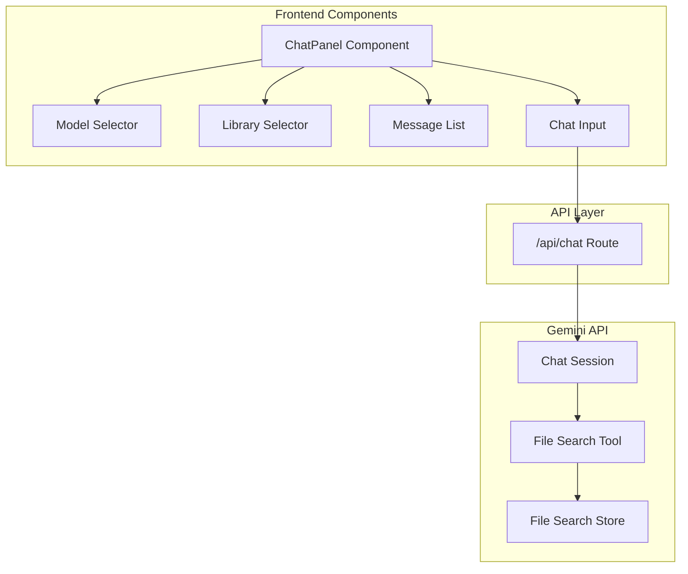

# Chat with Documents Feature

## Architecture Overview




## Implementation Plan

### 1. Create Chat API Route

Create [`app/api/chat/route.ts`](app/api/chat/route.ts) to handle chat requests with file search grounding:

- Accept POST requests with `message`, `model`, `storeId`, and `history` (previous messages)
- Use the existing `getAI()` helper from [`lib/gemini.ts`](lib/gemini.ts)
- Create a chat session with file search tool configured for the selected store
- Stream responses back to the client for real-time feedback

Model options:

- `gemini-2.5-flash` - Best price-performance, stable
- `gemini-3-flash-preview` - Latest with enhanced reasoning

### 2. Add Chat Types

Update [`lib/types.ts`](lib/types.ts) with:

```typescript
export interface ChatMessage {
  role: 'user' | 'model';
  content: string;
  groundingChunks?: GroundingChunk[];
}

export interface GroundingChunk {
  documentUri?: string;
  snippet?: string;
}
```


### 3. Create Chat Hook

Add to [`lib/hooks.ts`](lib/hooks.ts):

- `useChatWithDocuments()` - Manages chat state, message history, and API calls with streaming support

### 4. Create Chat UI Components

Create [`app/components/ChatPanel.tsx`](app/components/ChatPanel.tsx):

- Model selector dropdown (Gemini 2.5 Flash / Gemini 3 Flash)
- Library selector dropdown (lists existing stores)
- Scrollable message list with user/model differentiation
- Input field with send button
- Loading state with streaming indicator
- Citation display from grounding metadata

### 5. Integrate Chat into Main Page

Update [`app/page.tsx`](app/page.tsx) to add the chat panel as a slide-out or modal view, accessible via a "Chat" button on each library card or in the header.

## Key Files to Create/Modify

| File | Action |

|------|--------|

| `app/api/chat/route.ts` | Create - Chat API with streaming |

| `app/components/ChatPanel.tsx` | Create - Main chat UI |

| `lib/types.ts` | Modify - Add chat types |

| `lib/hooks.ts` | Modify - Add chat hook |

| `app/page.tsx` | Modify - Add chat toggle |

| `app/components/StoreCard.tsx` | Modify - Add chat button |

## UI Design Notes

- Slide-out panel from the right side or fullscreen modal
- Dark theme consistent with existing design (`#0a0a14`, `#1a1a2e`)
- Accent color for model messages (`#6366f1` indigo)
- User messages aligned right, model messages aligned left