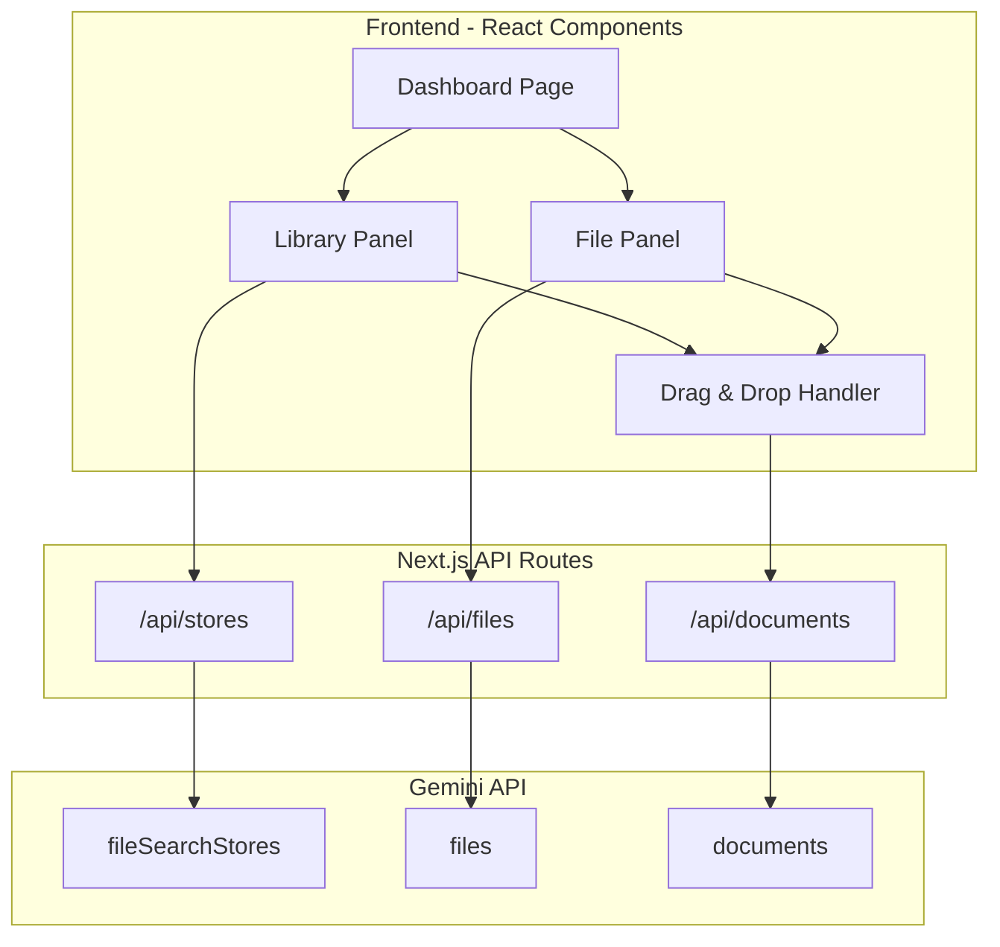

# Gemini File Search Visualizer

## Architecture Overview

## Tech Stack
- **Next.js 16** with App Router (already set up)
- **@google/genai** SDK for Gemini API
- **React DnD** for drag-and-drop functionality
- **Tailwind CSS 4** (already configured)

## UI Design

A split-panel dashboard:
- **Left Panel**: File Search Stores (Libraries) - collapsible cards showing store name, document count, and contained documents
- **Right Panel**: Uploaded Files - grid of file cards with name, type, size, upload date
- **Drag-and-Drop**: Drag files from the right panel into any library on the left to import them

## Key Files

| File | Purpose |
|------|---------|
| [`app/page.tsx`](app/page.tsx) | Main dashboard with split layout |
| `app/api/stores/route.ts` | GET/POST for stores CRUD |
| `app/api/stores/[storeId]/route.ts` | DELETE specific store |
| `app/api/stores/[storeId]/documents/route.ts` | GET/POST/DELETE documents in a store |
| `app/api/files/route.ts` | GET all files, POST to upload |
| `app/api/files/[fileId]/route.ts` | DELETE specific file |
| `app/components/StoreCard.tsx` | Library card component (drop target) |
| `app/components/FileCard.tsx` | Draggable file component |
| `app/components/UploadZone.tsx` | File upload dropzone |
| `lib/gemini.ts` | Gemini SDK initialization |

## Implementation Details

### 1. API Layer
Server-side API routes that call the Gemini SDK:
- **Stores**: List all `fileSearchStores`, create new stores, delete stores
- **Files**: List all uploaded `files`, upload new files, delete files
- **Documents**: List documents within a store, import files into stores, delete documents

### 2. State Management
React Query (TanStack Query) for:
- Caching API responses
- Automatic refetching after mutations
- Optimistic updates for smooth drag-and-drop UX

### 3. Drag-and-Drop Flow
1. User drags a file card from the Files panel
2. Hovers over a Library card (visual feedback)
3. Drops - triggers `POST /api/stores/[storeId]/documents` 
4. API calls `ai.fileSearchStores.importFile()`
5. Poll operation until complete, then refresh

### 4. Visual Design
- Dark theme with accent colors
- Cards with subtle gradients and shadows
- Smooth animations for drag-and-drop feedback
- Loading skeletons during data fetches
- Toast notifications for actions