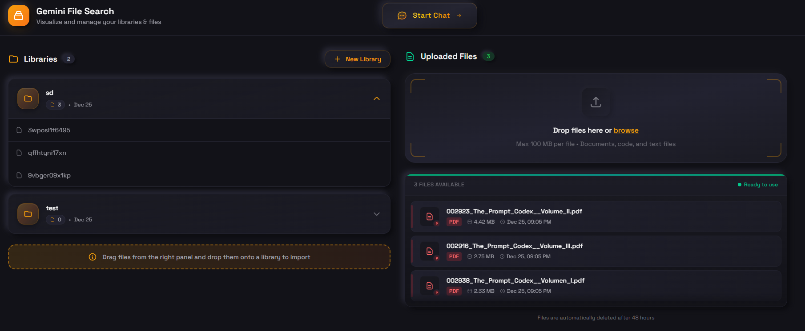

<p align="center">
  
</p>

<h1 align="center">Gemini File Search</h1>

<p align="center">
  <strong>A beautiful visual interface for Google's Gemini File Search API</strong>
</p>

<p align="center">
  <a href="#-why-this-project">Why?</a> •
  <a href="#-features">Features</a> •
  <a href="#-getting-started">Getting Started</a> •
  <a href="#-tech-stack">Tech Stack</a> •
  <a href="#-license">License</a>
</p>

<br />

<p align="center">
  
</p>

---

## 🤔 Why This Project?

Google's **Gemini File Search** is an incredibly powerful feature that lets you upload documents and chat with them using AI. However, there's one major problem:

> **It's API-only.** No UI. No dashboard. No visual way to manage your files and libraries.

This means if you want to:

- See all your uploaded files
- Create and manage libraries (stores)
- Add files to libraries
- Chat with your documents

...you'd have to write code or use curl commands every single time. 😫

**That's why I built this project.** A clean, modern interface that visualizes every feature Gemini File Search offers, so you can manage and interact with your files effortlessly.

---

## ✨ Features

- 📁 **Library Management** — Create, view, and delete libraries (file search stores)
- 📄 **File Uploads** — Drag & drop files to upload them to Gemini
- 🔗 **Drag-to-Import** — Simply drag files onto a library to add them
- 💬 **Chat with Documents** — Ask questions about your files using Gemini AI
- 🤖 **Multiple Models** — Choose between Gemini 2.5 Flash and Gemini 3 Flash
- 📚 **Source Citations** — See exactly which documents the AI used to answer
- 🌙 **Beautiful Dark UI** — Modern neumorphic design that's easy on the eyes

---

## 🚀 Getting Started

Follow these simple steps to run the project locally. No advanced technical knowledge required!

### Prerequisites

- [Bun](https://bun.sh) — A fast JavaScript runtime and package manager
- A Gemini API key — Get one free at [Google AI Studio](https://aistudio.google.com/apikey)

### Step 1: Clone the Repository

```bash
git clone https://github.com/aminanvary/Gemini-File-Search.git
cd Gemini-File-Search
```

### Step 2: Install Dependencies

```bash
bun install
```

### Step 3: Set Up Your API Key

1. Rename `.env.local.example` to `.env.local`
2. Open the file and add your Gemini API key:

```env
GEMINI_API_KEY=your_actual_api_key_here
```

### Step 4: Run the Project

```bash
bun dev
```

That's it! 🎉 Open [http://localhost:3000](http://localhost:3000) in your browser and start managing your Gemini files.

---

## 💻 Tech Stack

- **Framework:** [Next.js 16](https://nextjs.org/) with App Router
- **Runtime:** [Bun](https://bun.sh/)
- **Styling:** [Tailwind CSS 4](https://tailwindcss.com/)
- **UI Components:** [Radix UI](https://radix-ui.com/)
- **AI SDK:** [@google/genai](https://www.npmjs.com/package/@google/genai)
- **State Management:** [TanStack Query](https://tanstack.com/query)
- **Drag & Drop:** [React DnD](https://react-dnd.github.io/react-dnd/)

---

## 📝 License

This project is open source and available under the [MIT License](LICENSE).

---

<p align="center">
  Made with ☕ by <a href="https://github.com/aminanvary">Amin Anvary</a>
</p>
